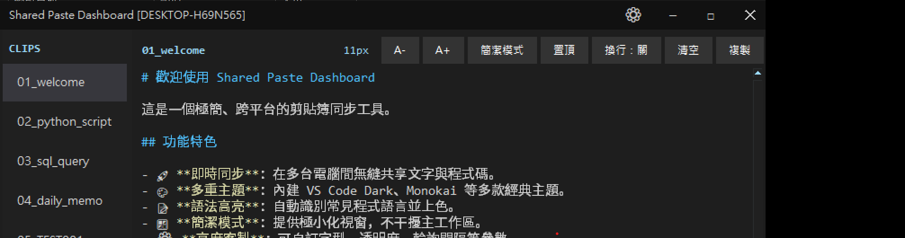
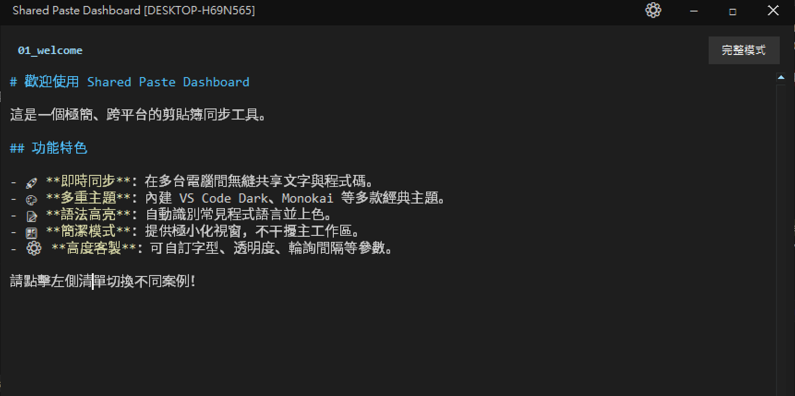
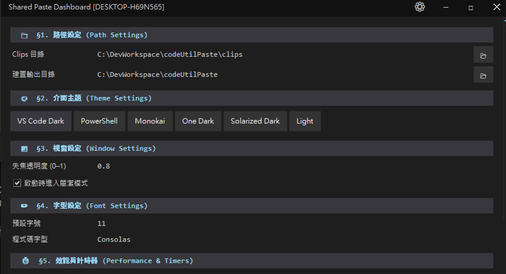

# Shared Paste Dashboard

[](LICENSE)
[](https://www.python.org/)
[]()

A lightweight, high-performance shared clipboard dashboard built with Python and Tkinter. Designed for sharing `.md` snippets across multiple machines over a local network (e.g., via NAS or shared folder such as `U:\paste\clips`).

---

## Table of Contents

- [Features](#features)
- [Screenshots](#screenshots)
- [Requirements](#requirements)
- [Installation](#installation)
- [Usage](#usage)
- [Configuration](#configuration)
- [Build as Executable](#build-as-executable)
- [Contributing](#contributing)
- [License](#license)

---

## Features

- **Borderless UI & Custom Controls** — Frameless window with double-click to maximize, custom drag, and 4-direction resize (left / bottom / bottom-left / bottom-right).
- **Theme-aware Scrollbar** — Sidebar scrollbar dynamically follows the active color theme; no default Windows white scrollbar.
- **Dynamic Font Scaling** — `Ctrl + Scroll` or `Ctrl + +/-` to zoom the editor font, matching VS Code behavior.
- **Dual Display Modes** — Seamlessly switch between Full Mode and Simple Mode to minimize desktop footprint.
- **Embedded Settings Panel** — Settings load inline within the main window — no popup dialogs.
- **Fully Configurable** — All polling intervals, highlight limits, opacity, fonts, and paths live in `settings.json`; no hardcoded values.
- **Syntax Highlighting** — Real-time highlighting for Markdown and common languages (Python, SQL, and more).

---

## Screenshots

### Full Mode



### Simple Mode



### Settings Mode



---

## Requirements

- Python 3.10 or higher (Tkinter is included in the standard library)

---

## Installation

```bash
git clone https://github.com/<your-username>/codeUtilPaste.git
cd codeUtilPaste
```

No runtime dependencies — Tkinter is included with Python.

---

## Usage

```powershell
py main.py
```

---

## Configuration

All settings are stored in `settings.json`. Key parameters:

| Section | Key | Description |
|---------|-----|-------------|
| §1 Path | `base_dir` | Clip storage and sync directory (e.g., `U:\paste\clips`) |
| §2 Theme | `theme` | Active color theme (`VS Code Dark`, `Monokai`, `Light`, etc.) |
| §3 Window | `window_geometry` | Default position and size on startup |
| §3 Window | `alpha_focused` / `alpha_unfocused` | Window opacity when focused / unfocused |
| §4 Font | `font_size` | Editor font size |
| §5 Performance | `check_interval_ms` | File-change polling interval (ms) |
| §6 Sync | `remote_hosts` | Comma-separated remote hostnames for multi-machine sync |

---

## Build as Executable

Run the bundled build script to compile a standalone `.exe`:

```powershell
scripts\build_exe.bat
```

Output: `dist/SharedPasteDashboard/SharedPasteDashboard.exe`

---

## Contributing

Contributions are welcome! Please read [CONTRIBUTING.md](CONTRIBUTING.md) before submitting a pull request.

---

## License

This project is licensed under the [MIT License](LICENSE).
