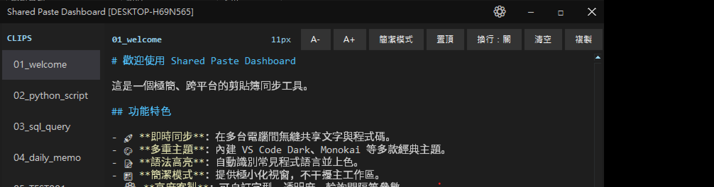
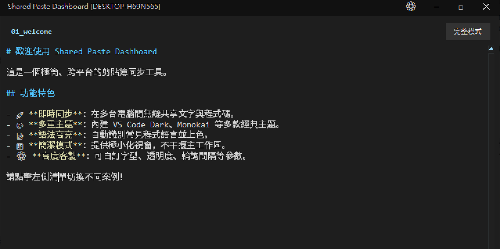
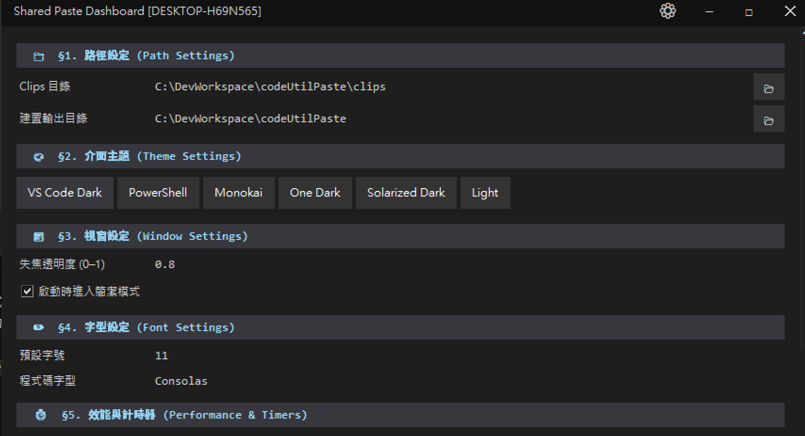

# Shared Paste Dashboard

[](LICENSE)
[](https://www.python.org/)
[]()

A lightweight, high-performance shared clipboard dashboard built with Python and Tkinter. Designed for sharing `.md` snippets across multiple machines over a local network (e.g., via NAS or shared folder such as `U:\paste\clips`).

---

## Table of Contents

- [Features](#features)
- [Screenshots](#screenshots)
- [Requirements](#requirements)
- [Installation](#installation)
- [Usage](#usage)
- [Configuration](#configuration)
- [Build as Executable](#build-as-executable)
- [Contributing](#contributing)
- [License](#license)

---

## Features

- **Borderless UI & Custom Controls** — Frameless window with double-click to maximize, custom drag, and 4-direction resize (left / bottom / bottom-left / bottom-right).
- **Theme-aware Scrollbar** — Sidebar scrollbar dynamically follows the active color theme; no default Windows white scrollbar.
- **Dynamic Font Scaling** — `Ctrl + Scroll` or `Ctrl + +/-` to zoom the editor font, matching VS Code behavior.
- **Dual Display Modes** — Seamlessly switch between Full Mode and Simple Mode to minimize desktop footprint.
- **Embedded Settings Panel** — Settings load inline within the main window — no popup dialogs.
- **Fully Configurable** — All polling intervals, highlight limits, opacity, fonts, and paths live in `settings.json`; no hardcoded values.
- **Syntax Highlighting** — Real-time highlighting for Markdown and common languages (Python, SQL, and more).
- **Safe Saving** — Flushes pending edits before adding/switching clips or closing; failed saves keep the editor open and retry.
- **Conflict Preservation** — Concurrent changes keep the remote original and save local edits as a separate conflict clip.

---

## Screenshots

### Full Mode



### Simple Mode



### Settings Mode



---

## Requirements

- Python 3.10 or higher (Tkinter is included in the standard library)

---

## Installation

```bash
git clone https://github.com/ericlight0025/clip-sync.git
cd clip-sync
```

No runtime dependencies — Tkinter is included with Python.

---

## Usage

```powershell
py main.py
```

---

## Configuration

Settings are stored beside the source modules when running Python, or beside the executable when packaged. Existing packaged `_internal/settings.json` settings remain readable and migrate to the executable directory on the next save. Key parameters:

| Section | Key | Description |
|---------|-----|-------------|
| §1 Path | `base_dir` | Clip storage and sync directory (e.g., `U:\paste\clips`) |
| §2 Theme | `theme` | Active color theme (`VS Code Dark`, `Monokai`, `Light`, etc.) |
| §3 Window | `window_geometry` | Default position and size on startup |
| §3 Window | `alpha_focused` / `alpha_unfocused` | Window opacity when focused / unfocused |
| §4 Font | `font_size` | Editor font size |
| §5 Performance | `check_interval_ms` | File-change polling interval (ms) |
| §6 Sync | `remote_hosts` | Comma-separated remote hostnames for multi-machine sync |

---

## Build as Executable

Run the bundled build script to compile a standalone `.exe`:

```powershell
scripts\build_exe.bat
```

Output: `dist/SharedPasteDashboard/SharedPasteDashboard.exe`

The final deployed executable is actually written to `<build_root>/SharedPasteDashboard/SharedPasteDashboard.exe` (default: `C:\BuildOutput\SharedPasteDashboard\SharedPasteDashboard.exe`). The `dist` directory is the intermediate PyInstaller output. The script currently uses `py -3.13`; install Python 3.13 for this script or adjust `PYTHON_VERSION` to your installed Python 3.10+ version.

The script stages all six runtime modules and checks their imports before packaging. Close the existing application after saving first: the build refuses to force-kill an editor and preserves the final directory's settings and user files.

## 儲存、同步與斷線處理

- 新增、切換 clip、開啟設定及關閉視窗前，先儲存編輯內容；失敗時保留原檔案與編輯區。
- 寫入失敗後至少每秒重試一次。共享資料夾恢復後會重新儲存；未完成儲存前不要強制結束程式。
- 若啟動時共享資料夾已斷線，尚未選取 clip 的本機編輯也會保留；連線恢復後另存為 `recovered_conflict_*.md`。
- 外部更新不會覆蓋尚未儲存的編輯。儲存時若發現版本不同，遠端原檔保留，本機內容另存為 `<原檔名>_conflict_<唯一識別碼>.md`，並切換至該副本。
- 每次寫入使用同目錄唯一暫存檔，再原子替換目標；以 `<檔名>.md.lock` 排他鎖協調同一檔案的寫入，並在鎖內核對內容版本。
- 所有電腦都應更新至這個版本，舊版程式及外部編輯器不會遵守本程式的鎖。實際一致性仍取決於共享檔案系統對排他建立與替換的支援。
- 正常結束寫入會清理暫存檔及鎖。若程式當機留下 `.lock`，確認所有電腦均未在寫入該檔案後，再人工移除對應鎖；程式不會自動搶走或刪除他人的鎖。
- 遭外部刪除的 clip 不會在讀取時被偷偷重建；尚未儲存的本機內容仍可另存衝突副本。

## 測試

```powershell
py -m unittest discover -s tests -v
py -m compileall -q .
```

回歸測試僅操作暫存資料夾，涵蓋未儲存編輯、同步衝突、斷線重試、關閉、並行寫入、暫存檔清理與打包模組完整性。UI 流程使用替身，不能取代真實 Windows／SMB 與 EXE 驗收；詳見 [本次修正與驗證紀錄](docs/review-fixes-2026-10-04.md)。

---

## Contributing

Contributions are welcome! Please read [CONTRIBUTING.md](CONTRIBUTING.md) before submitting a pull request.

---

## License

This project is licensed under the [MIT License](LICENSE).
